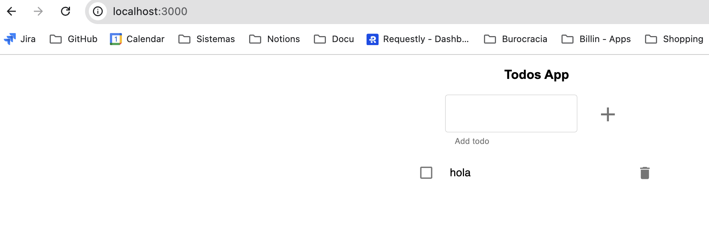

# 00-monolith-in-mem

## PASO 1

Creamos la imagen docker de la app (con el usuario para poder subirla a DockerHub)

```bash
 docker build -t sitobusnan/todoapp .
```

Para subirla a DockerHub

```bash
docker push sitobusnan/todoapp
```

## PASO 2

Creamos un deployment mediante un archivo `deployment.yaml`:

```yaml
apiVersion: apps/v1
kind: Deployment
metadata:
  name: todoapp00
spec:
  selector:
    matchLabels:
      app: todoapp00
      exercise: "00"
  template:
    metadata:
      labels:
        app: todoapp00
        exercise: "00"
    spec:
      containers:
        - name: todoapp00
          image: sitobusnan/todoapp
          env:
            - name: PORT
              value: "3000"
            - name: NODE_ENV
              value: "development"
```

y lo aplicamos al cluster:

```bash
    kubectl apply -f ./deployment.yaml
```

## PASO 3

Crear un LoadBalancer service para acceder al Deployment anteriormente creado desde fuera del clúster. 

Con el servicio de tunnel de Minikube levantado:

```bash
    minikube tunnel
```

podemos exponer la app del deployment del PASO 2:

```bash
    kubectl expose deployment todoapp00 --type=LoadBalancer --port=3000
```

ahora podremos comprobar que tenemos un servicio activo que expone la aplicación:

```bash
    kubectl get svc
```

`todoapp00    LoadBalancer   10.98.29.32   127.0.0.1     3000:31435/TCP   8s`

Por último en el navegador ya podremos acceder a la aplicación:

